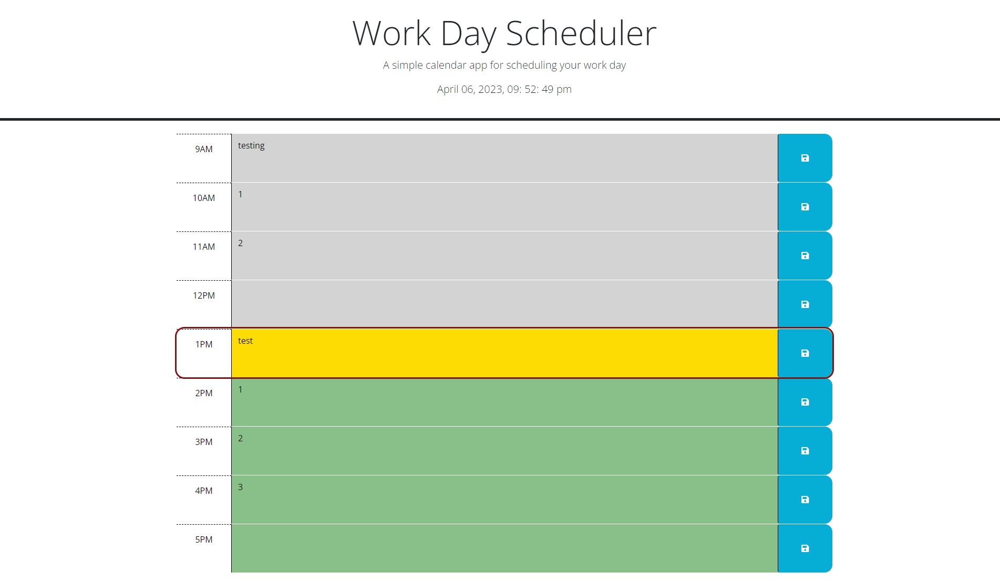

# daily-planner

A daily schedule that displays tasks to be done, tasks that have passed, and future tasks. Everything can be saved to local storage for the next time the page is viewed. This daily planner is meant to show tasks to be done during work hours(9am-5pm). Future tasks will show up as green, past tasks will show up as grey, and current tasks will show up as red and yellow. The current date and time are displayed at the top of the page.

## Instructions and Usage

No installation required.

Once on the page enter in a task to be completed on the desired hour of the day. Then select the save button on the right side of the text area. Watch the changing colors to check what task is up next to complete.

## view <a href="https://jesseemerson7.github.io/daily-planner/">Live page!</a>

 

## License

MIT license.

## Contact

Contact me via email at : <a href="mailto:jesseemerson7@gmail.com">jesseemerson7@gmail.coma</a>
